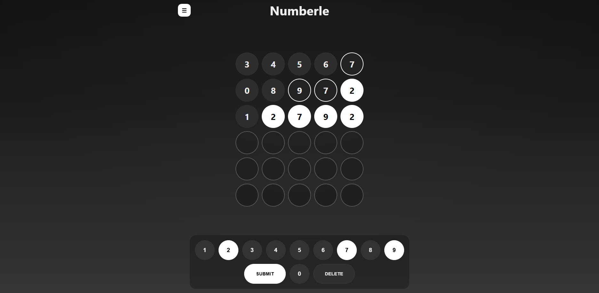
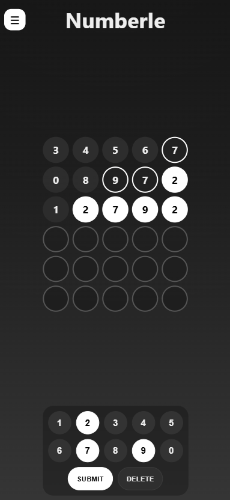
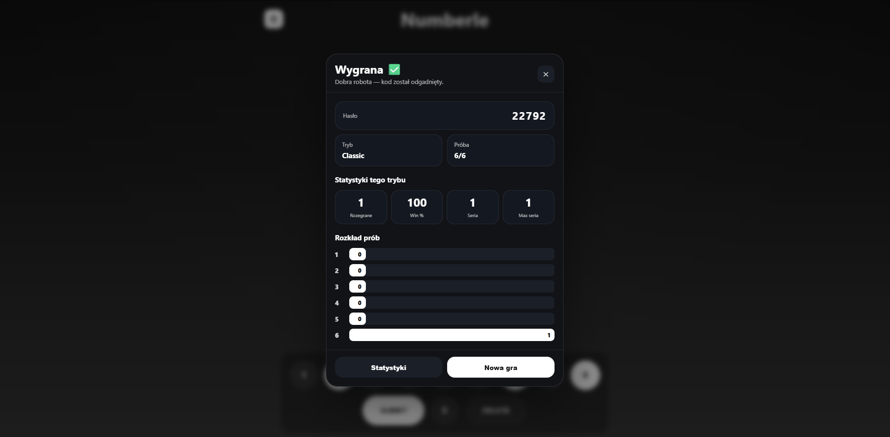

# Numberle

**Numberle** is a responsive logic game inspired by Wordle, but instead of guessing words, the player guesses a code made of digits. The project was built with React + TypeScript and includes multiple game modes, statistics, a Daily Challenge and a bot opponent.

## Live demo

Play here:  
**[https://pudelkoo.github.io/numberle/](https://puudelkoo.github.io/numberle/)**

## Preview

<p align="center">
  
</p>

<p align="center">
  <b>Desktop gameplay</b><br />
  Main game view with the board, on-screen keyboard and dark theme.
</p>

<p align="center">
  
</p>

<p align="center">
  <b>Mobile layout</b><br />
  Responsive layout adapted for smaller screens.
</p>

<p align="center">
  
</p>

<p align="center">
  <b>Result summary</b><br />
  Game summary with the result, statistics and guess distribution.
</p>

## Tech stack

<p>
  
</p>

- React
- TypeScript
- Vite
- CSS
- LocalStorage
- GitHub Pages
- GitHub Actions

## Features

- multiple game modes,
- responsive desktop and mobile interface,
- locally saved statistics,
- Daily Challenge available once per day,
- Mastermind mode with classic `B` / `C` feedback,
- bot opponent mode,
- light and dark theme,
- physical and on-screen keyboard support.

## Game modes

### Classic

The standard mode where the player guesses a digit code. Digits can repeat.

### No Repeats

A mode where the secret code does not contain repeated digits.

### Hard Mode

A more challenging version of the game with additional restrictions for the next guesses.

### Daily Challenge

A daily puzzle with one unique code for each day. The result can be saved only once per day.

### Mastermind

A mode inspired by the classic Mastermind game. Instead of tile colors, the player receives feedback:

- `B` — correct digit in the correct position,
- `C` — correct digit in the wrong position.

Available levels:

- Easy,
- Medium,
- Hard.

### Bot Mode

In Classic mode, the player can play against a bot. The bot and the player take turns guessing the same secret code.

Bot levels:

- Easy — random guesses,
- Medium — guesses narrowed down based on previous feedback,
- Hard — more optimized move selection.

## Running locally

Clone the repository:

```bash
git clone https://github.com/pudelkoo/numberle.git
```

Go to the project folder:

```bash
cd numberle
```

Install dependencies:

```bash
npm install
```

Run the project locally:

```bash
npm run dev
```

Build the production version:

```bash
npm run build
```

## Deployment

The project is hosted on **GitHub Pages**.  
Deployment is handled automatically with **GitHub Actions** after each push to the `main` branch.

## Project status

The project is a working version of the game with completed modes, statistics and a responsive UI. Future improvements may include animations, an improved result screen, PWA support or tests.
